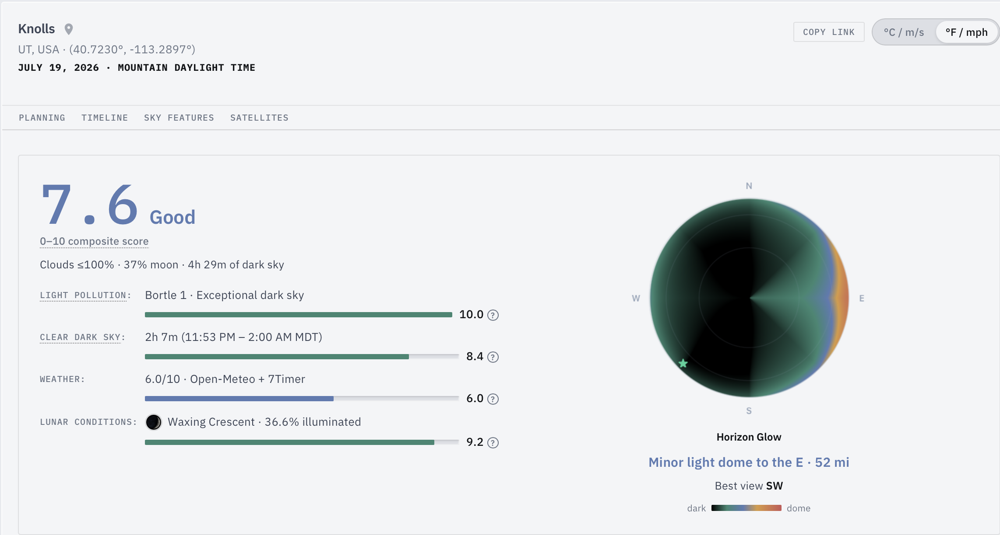
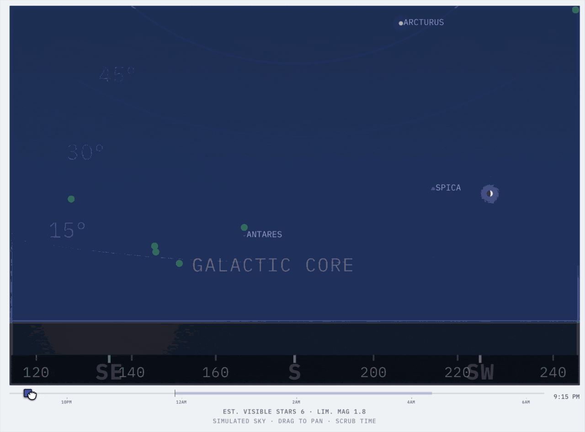
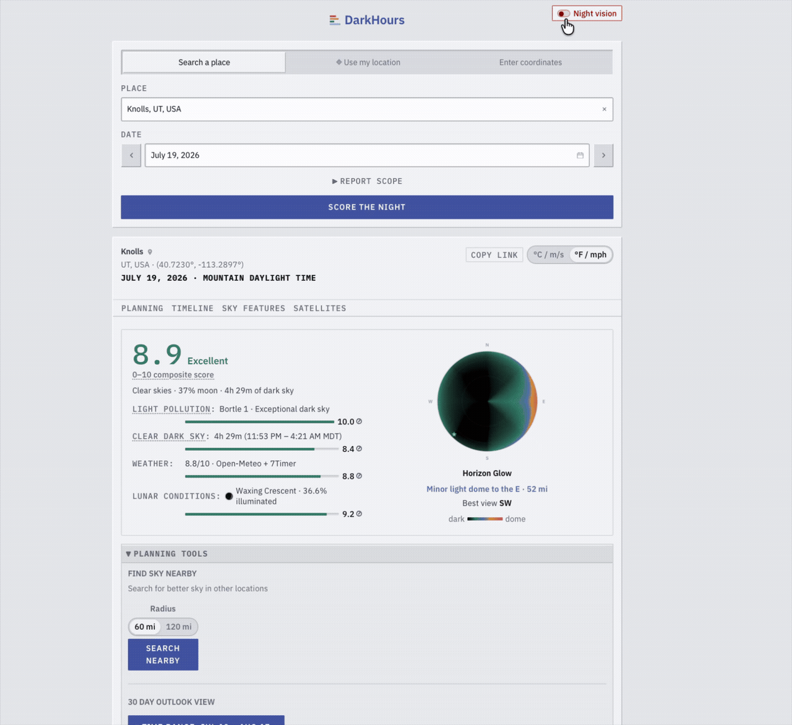
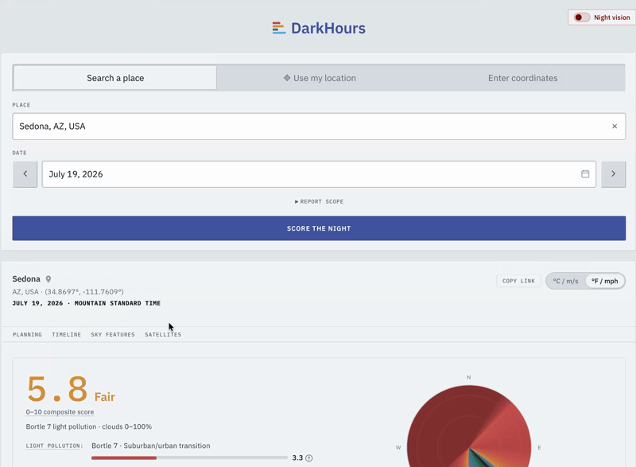

# DarkHours

**DarkHours is a precision landscape astrophotography planning tool to help you determine if a given location and night is worth the trip. If it isn't, it helps you find another place and time.**

Pick a place and a date. DarkHours presents a score, an hour by hour plan of what to shoot and when, and a list of darker spots to drive to if local conditions don't hold up.

**Visit at: [https://darkhours.app](https://darkhours.app)**

---

## What you get

**The night's score.** The Night Quality Score runs 1 to 10. It folds together weather, moonlight, clear dark hours, and light pollution data. We use a geometric mean, not a plain average. This means that one dealbreaker can't hide behind three good numbers. A clouded out night scores like a clouded out night should.

**Moonlight math.** Most apps say the moon is up, so you're done. That's lazy. DarkHours figures out how much the moon actually brightens the sky at each target. A thin crescent barely counts. A bright gibbous moon next to your subject gets flagged, and the imaging window gets cut off exactly when the contrast dies.

**Tonight's best targets.** You see the best deep sky objects, planets, and showers for a night. Each one gets a shooting window or a reason when it won't work: Clouded out. Moon washout. Lost in light dome. Low radiant.

**A darker spot within driving distance.** The find nearby feature hunts for darker sky up to 120 miles out. Results come back as places you can actually drive to. Places like trailheads, parking, viewpoints, campsites, or observatories. Each one on public land, with drive time, road distance, warnings for dirt roads, and directions via a Google Maps link.

**Walk the sky before you load the car.** DarkHours provides a rendered view of tonight's **real sky** based on forecasted and known conditions. About 12,000 stars sit in the right spot with appropriate brightness and color. The Milky Way band is there. So is the moon at its true phase, with the glow from cities on your horizon. Scrub the time slider from sunset to sunrise. Watch what shows up change hour by hour. All computed from actual data.

Here's the rest of it:

- **Weather built for astronomy.** Cloud cover split by altitude. Seeing and transparency. Wind, dew point, humidity. Every hour gets rated for shooting, and a live "Now" row tracks the current hour.
- **A live smoke and haze check.** Real time ground station air readings to catch fast moving smoke that a forecast may have missed.
- **Your horizon glow, mapped.** An all sky view of the light domes around you. See which way is darkest and how high the nearest city glow climbs.
- **Milky Way planning.** Arch window, core altitude and bearing, arch angle, and the best time to shoot it.
- **Aurora forecast.** Space weather Kp forecasts scored for your latitude. No hype. You get told straight: overhead, low on the horizon, or camera only.
- **Meteor showers that fade right.** Peak night alerts plus rates that drop off as you move away from the peak, corrected for radiant height and sky brightness.
- **Satellite passes.** ISS, Hubble, Tiangong, and fresh Starlink trains while they're still bright. Rise, peak, set, and moon distance for each.
- **A 30 day outlook.** A calendar heatmap of next month's scores with moon phases and meteor and aurora markers. Spot the best night in one glance.
- **Night vision mode.** One tap turns the whole screen red. Check the forecast in the field without wrecking your night vision, or ruining your shot with stray light from your phone.
- **Made for astrophotography.** Shareable links, an imperial and SI toggle, use my location, place autocomplete, and a layout that works on your phone. No account. No cookies. Free and open source.

Complete feature set in [docs/FEATURES.md](docs/FEATURES.md).

### See it in action

**360 degree simulated sky.** Drag to pan, scrub through the night.

**Red night vision mode.** One tap, the whole UI flips.

**Find darker sky nearby.** Search, compare, click through.

---

## The science behind it

Physics matters.

Take the moon. A 5 percent crescent low on the horizon brightens the sky at your target by about 0.06 magnitude. You'd never notice it. A 75 percent gibbous brightens the sky by 1.73 magnitude, posing significant photographic challenges. The model understands that the moon's effect on the sky is not a binary on or off phenomenon.

**It computes sky brightening at each target's spot all night long**. The model pairs Krisciunas and Schaefer (1991) lunar photometry with a Winkler (2022) single scatter kernel, a two component Rayleigh plus Henyey-Greenstein phase function. It pulls live aerosol optical depth from Open-Meteo CAMS. It corrects for the real Earth to Moon distance with an inverse square term. Then it cuts each imaging window at the exact point where scattered moonlight beats the contrast threshold for that kind of object.

The Night Quality Score (1 to 10) is a weighted geometric mean of four things:

| Factor | Weight | What it measures |
|--------|-------:|------------------|
| Seeing and cloud cover | 40% | Cn2 profile integration via 7Timer ASTRO/GFS, adjusted for clouds |
| Lunar interference | 25% | K&S sky brightening credit, not raw illumination percent |
| Clear dark sky hours | 25% | Effective dark time, corrected for the moon |
| Bortle scale | 10% | VIIRS 2025 satellite radiance, with a Falchi 2016 fallback for truly dark sites |

If a factor is not available, like a date that's past the forecast window, the weights shift on their own. A night two months out still lines up fairly against tonight.

For details like severity thresholds, the weather rating formula, meteor shower rate decay, and the two tier light pollution logic, they live in [docs/CLI.md](docs/CLI.md), [docs/TARGETS.md](docs/TARGETS.md), and [docs/RASTERIO_REPLACEMENT.md](docs/RASTERIO_REPLACEMENT.md).

## Where the data comes from

Every number traces back to a public source you can check:

| Domain | Source |
|--------|--------|
| Light pollution | NASA/NOAA VIIRS Black Marble 2025, Falchi et al. World Atlas 2016 |
| Weather and seeing | NOAA/NWS, Open-Meteo (with ERA5 reanalysis back to 1940), 7Timer ASTRO |
| Air quality | WAQI (World Air Quality Index Project) |
| Space weather | NOAA SWPC (Kp forecast and outlook) |
| Satellites | CelesTrak (TLEs) |
| Places and public lands | OpenStreetMap, USGS PAD-US |
| Stars and sky imagery | HYG database, ESO |

Every source retains its original open license. Full credit is in [docs/ACKNOWLEDGMENTS.md](docs/ACKNOWLEDGMENTS.md).

---

## Two ways to use it

- **The web app.** [darkhours.app](https://darkhours.app). This is the full ride. The 360 degree sky dome, the all sky light dome panel, the 30 day heatmap, red night vision mode. Nothing to install. Details in [apps/web/README.md](apps/web/README.md).
- **The command line.** Same engine, runs offline from cache, right in your terminal.
  - **`darkhours.py`** gives single night reports, monthly calendars, and nearby dark sky search for one spot. It reaches back to 1940 for historical weather. See [docs/CLI.md](docs/CLI.md).
  - **`tripbuilder.py`** scores several sites across a date range and ranks the best nights. See [docs/TRIPBUILDER.md](docs/TRIPBUILDER.md).

  Setup is a Python 3.13 virtualenv and one `pip install`. Steps are in [docs/INSTALL.md](docs/INSTALL.md).

---

## Documentation

| Doc | Scope |
|-----|--------------|
| [docs/FEATURES.md](docs/FEATURES.md) | The full user facing feature list |
| [docs/CLI.md](docs/CLI.md) | `darkhours.py` reference. Flags, output, and the science per section |
| [docs/TRIPBUILDER.md](docs/TRIPBUILDER.md) | `tripbuilder.py` reference. Multi site scoring |
| [docs/INSTALL.md](docs/INSTALL.md) | Local install, configuration, and running the tests |
| [docs/ARCHITECTURE.md](docs/ARCHITECTURE.md) | Engine layout, data caching, offline spatial indexes |
| [docs/DEPLOYMENT.md](docs/DEPLOYMENT.md) | The optional AWS cloud deployment for the API and web app |
| [docs/TARGETS.md](docs/TARGETS.md) | Target catalog schema and meteor shower rate decay model |
| [docs/ACKNOWLEDGMENTS.md](docs/ACKNOWLEDGMENTS.md) | Full data source credit |

---

## License

MIT. See [LICENSE](LICENSE).

This is a personal, non commercial project. Every third party data source is used within its free tier terms for personal, non commercial use.

Built with help from GitHub Copilot and Claude.
